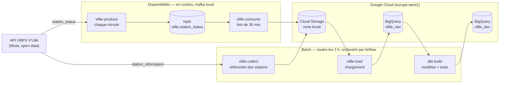

# V'Lille — pipeline de données

Projet personnel d'apprentissage. Il collecte la disponibilité des stations de vélos en libre-service
V'Lille (open data de la Métropole Européenne de Lille) en continu avec Kafka, la stocke dans Google
Cloud, la modélise dans BigQuery avec dbt et orchestre les traitements par lots avec Airflow.

Le but est d'apprendre ces outils sur un cas concret, de bout en bout. Ce n'est pas un système de
production : tout ce qui tourne en continu (Airflow, Kafka) tourne sur un poste personnel, sous Docker.

**Questions métier traitées :** quelles stations sont souvent vides ou pleines, et lesquelles demandent
un rééquilibrage.

## Architecture



Chaque donnée a une seule voie d'entrée : les **disponibilités** des stations arrivent en continu par
Kafka, le **référentiel** des stations (nom, capacité, position) par la collecte batch. Le batch
charge ensuite les deux dans BigQuery et reconstruit les modèles dbt. Détails :
[architecture technique](docs/architecture.md).

## Ce qui tourne

Tout démarre avec Docker Desktop, sans action manuelle.

**Stream, en continu (conteneurs Kafka)**

| Traitement | Quand | Rôle |
|---|---|---|
| `producer` (`vlille-produce`) | chaque minute | lit les disponibilités et publie dans Kafka chaque station dont l'état a changé |
| `consumer` (`vlille-consume`) | lot toutes les 30 min, ou dès 10 000 messages | écrit les messages dans la zone brute GCS (`kafka/`) |

**Batch, toutes les 3 heures (DAG Airflow `vlille_pipeline`)**

| Tâche | Rôle |
|---|---|
| `collect` (`vlille-collect`) | archive le référentiel des stations dans la zone brute GCS (`gbfs/`) |
| `load` (`vlille-load`) | charge hier et aujourd'hui dans BigQuery : `raw_station_information`, `raw_station_status_stream` |
| `dbt_build` | reconstruit les modèles de `vlille_dev` (staging, historique SCD2, faits, mart) et lance les 32 tests |

Côté Google, sans dépendre du poste : suppression des fichiers de la zone brute après 30 jours.

| Couche | Outil | Rôle dans le projet |
|---|---|---|
| Source | [GBFS](https://gbfs.org/) V'Lille | Flux JSON public : référentiel des stations et disponibilité, rafraîchi chaque minute |
| Collecte | Python 3.12 ([httpx](https://www.python-httpx.org/), [pydantic](https://docs.pydantic.dev/)) | Lit l'API, valide les données, archive le référentiel |
| Zone brute | [Cloud Storage](https://cloud.google.com/storage/docs) | Réponses conservées telles que reçues, 30 jours |
| Entrepôt | [BigQuery](https://cloud.google.com/bigquery/docs) | Tables brutes partitionnées, puis tables modélisées |
| Transformation | [dbt Core](https://docs.getdbt.com/) | SQL versionné et testé : staging, historique SCD2, faits, mart |
| Orchestration | [Apache Airflow 3](https://airflow.apache.org/docs/) | Enchaîne collecte du référentiel → chargement → dbt toutes les 3 heures |
| Temps réel | [Apache Kafka 4](https://kafka.apache.org/documentation/) | Seule voie d'entrée des disponibilités : chaque nouvelle remontée de station jusqu'à la zone brute |
| Outillage | [uv](https://docs.astral.sh/uv/), [pytest](https://docs.pytest.org/), [ruff](https://docs.astral.sh/ruff/), [Docker](https://docs.docker.com/), GitHub Actions | Environnement reproductible, tests, lint, conteneurs, CI |

## Documentation

| Document | Contenu |
|---|---|
| [Liens utiles](docs/liens.md) | Interfaces locales (Airflow, dbt), consoles GCP, GitHub, source de données, documentation des outils |
| [Architecture technique](docs/architecture.md) | Traitements et horaires, conteneurs, stockage, tables, garanties, limites |
| [Guide du projet](docs/guide/README.md) | Les étapes de mise en place, une par chapitre : outils, bibliothèques, fonctionnement, où regarder |
| [Lancer le projet (RUN)](docs/RUN.md) | Installation, toutes les commandes, redémarrage après un reboot, dépannage |
| [Décisions techniques (ADR)](docs/decisions/) | Pourquoi chaque choix, alternatives écartées, limites |
| [Ressources GCP](infra/README.md) | Commandes de création du bucket et des tables |
| [Feuille de route](ROADMAP.md) | Étapes réalisées |

## Démarrage rapide

Prérequis : uv, Docker Desktop, le CLI Google Cloud et un projet GCP (détails dans [RUN.md](docs/RUN.md)).

```bash
uv sync
cp .env.example .env
gcloud auth application-default login
uv run pytest
docker compose -f airflow/docker-compose.yml up -d --build
docker compose -f kafka/docker-compose.yml up -d --build
```

Interfaces locales (tous les liens : [docs/liens.md](docs/liens.md)) :

| Interface | Adresse |
|---|---|
| Airflow | http://localhost:8081 |
| Documentation dbt (après `dbt docs serve`) | http://localhost:8080 |

## Structure du dépôt

```
src/vlille/          code Python (collecte, chargement, producteur et consommateur Kafka)
tests/               tests pytest, sans réseau (GCS, BigQuery et Kafka simulés)
dbt/                 projet dbt : modèles, snapshot, tests de données
airflow/             image, docker-compose et DAG Airflow
kafka/               docker-compose de Kafka, du producteur et du consommateur, image du projet
infra/               définitions des ressources GCP (bucket, tables)
docs/                guide, procédure de lancement, décisions (ADR)
```

## Limites connues

- Airflow, Kafka, le producteur et le consommateur tournent seulement quand le poste est allumé avec
  Docker Desktop lancé : les données ont des trous.
- Kafka n'a qu'un broker, donc aucune réplication.
- Les indicateurs du mart sont calculés sur le nombre de remontées, approximation de la durée.
- BigQuery est rafraîchi toutes les 3 heures : la collecte est continue, l'analyse ne l'est pas.
