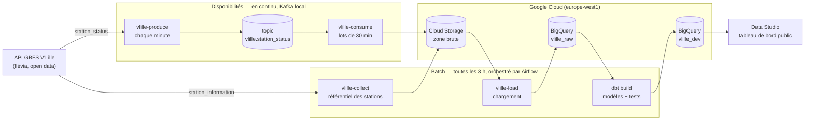

# V'Lille — pipeline de données

Projet personnel d'apprentissage. Il collecte la disponibilité des stations de vélos en libre-service
V'Lille (open data de la Métropole Européenne de Lille) en continu avec Kafka, la stocke dans Google
Cloud, la modélise dans BigQuery avec dbt et orchestre les traitements par lots avec Airflow.

Le but est d'apprendre ces outils sur un cas concret, de bout en bout. Ce n'est pas un système de
production : tout ce qui tourne en continu (Airflow, Kafka) tourne sur un poste personnel, sous Docker.

**Questions métier traitées :** quelles stations sont souvent vides ou pleines, et lesquelles demandent
un rééquilibrage.

**[Voir le tableau de bord](https://datastudio.google.com/reporting/94e9208b-e444-4b38-a2eb-7d2ecd21763e)** (Data Studio, public, sans compte) : saturation des stations par
jour (carte et classement) et état actuel (vélos disponibles à la dernière remontée chargée).

> **Données par intermittence.** La collecte, Kafka et Airflow tournent sur un poste personnel, sous
> Docker, uniquement quand il est allumé. Il est donc normal que le tableau de bord ne soit pas à jour :
> il affiche les dernières données collectées, et l'historique comporte des trous. Quand le pipeline
> tourne, les données ont jusqu'à 3 h 30 de retard (lots de 30 minutes, chargement toutes les 3 heures).

## Architecture



Chaque donnée a une seule voie d'entrée : les **disponibilités** des stations arrivent en continu par
Kafka, le **référentiel** des stations (nom, capacité, position) par la collecte batch. Le batch
charge ensuite les deux dans BigQuery et reconstruit les modèles dbt. Détails :
[architecture technique](docs/architecture.md).

## Ce qui tourne

Tout démarre avec Docker Desktop, sans action manuelle.

**Stream, en continu (conteneurs Kafka)**

| Traitement | Quand | Rôle |
|---|---|---|
| `producer` (`vlille-produce`) | chaque minute | lit les disponibilités et publie dans Kafka chaque station dont l'état a changé |
| `consumer` (`vlille-consume`) | lot toutes les 30 min, ou dès 10 000 messages | écrit les messages dans la zone brute GCS (`kafka/`) |

**Batch, toutes les 3 heures (DAG Airflow `vlille_pipeline`)**

| Tâche | Rôle |
|---|---|
| `collect` (`vlille-collect`) | archive le référentiel des stations dans la zone brute GCS (`gbfs/`) |
| `load` (`vlille-load`) | charge hier et aujourd'hui dans BigQuery : `raw_station_information`, `raw_station_status_stream` |
| `dbt_build` | reconstruit les modèles de `vlille_dev` (staging, historique SCD2, faits, marts) et lance les 31 tests de données |

Côté Google, sans dépendre du poste : suppression des fichiers de la zone brute après 30 jours.

## Technologies

| Technologie | Rôle dans le projet |
|---|---|
| GCP — Cloud Storage | Zone brute : réponses de l'API et messages Kafka conservés tels que reçus, 30 jours |
| GCP — BigQuery | Entrepôt : tables brutes partitionnées, puis tables modélisées |
| dbt | Transformations SQL versionnées et testées : staging, historique SCD2, faits, marts |
| Airflow | Orchestration du batch : référentiel, chargement, dbt, toutes les 3 heures |
| Kafka | Ingestion en continu des disponibilités des stations |
| Data Studio | Tableau de bord public sur les marts |
| Docker | Exécution locale d'Airflow, de Kafka, du producteur et du consommateur (Docker Compose) |

La collecte et le chargement sont écrits en Python.

## Documentation

| Document | Contenu |
|---|---|
| [Liens utiles](docs/liens.md) | Interfaces locales (Airflow, dbt), consoles GCP, GitHub, source de données, documentation des outils |
| [Architecture technique](docs/architecture.md) | Traitements et horaires, conteneurs, stockage, tables, garanties, limites |
| [Lancer le projet (RUN)](docs/RUN.md) | Installation, toutes les commandes, redémarrage après un reboot, dépannage |
| [Décisions techniques (ADR)](docs/decisions/) | Pourquoi chaque choix, alternatives écartées, limites |
| [Ressources GCP](infra/README.md) | Commandes de création du bucket et des tables |
| [Feuille de route](ROADMAP.md) | Étapes réalisées |

## Lancer le projet

Installation, commandes et redémarrage : voir [RUN.md](docs/RUN.md).

Interfaces (tous les liens : [docs/liens.md](docs/liens.md)) :

| Interface | Adresse |
|---|---|
| Tableau de bord (public) | https://datastudio.google.com/reporting/94e9208b-e444-4b38-a2eb-7d2ecd21763e |
| Airflow | http://localhost:8081 |
| Documentation dbt (après `dbt docs serve`) | http://localhost:8080 |

## Structure du dépôt

```
src/vlille/          code Python (collecte, chargement, producteur et consommateur Kafka)
tests/               tests automatisés, sans réseau (GCS, BigQuery et Kafka simulés)
dbt/                 projet dbt : modèles, snapshot, tests de données
airflow/             image, docker-compose et DAG Airflow
kafka/               docker-compose de Kafka, du producteur et du consommateur, image du projet
infra/               définitions des ressources GCP (bucket, tables)
docs/                guide, procédure de lancement, décisions (ADR)
```

## Limites connues

- Airflow, Kafka, le producteur et le consommateur tournent seulement quand le poste est allumé avec
  Docker Desktop lancé : les données ont des trous.
- Kafka n'a qu'un broker, donc aucune réplication.
- Les indicateurs du mart sont calculés sur le nombre de remontées, approximation de la durée.
- BigQuery est rafraîchi toutes les 3 heures : la collecte est continue, l'analyse ne l'est pas.
