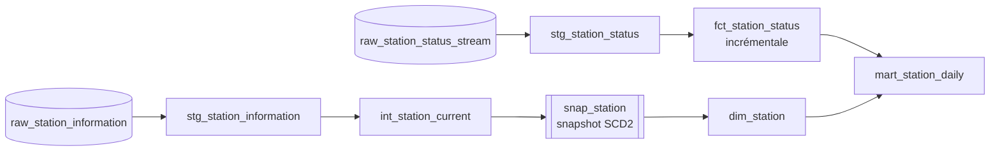

# 5. Modélisation avec dbt

## dbt en bref

[dbt](https://docs.getdbt.com/) (*data build tool*) exécute des transformations SQL **dans
l'entrepôt** : il ne déplace pas de données. Chaque modèle est un fichier `SELECT` ; dbt le
**matérialise** (vue, table, table incrémentale), en déduit l'**ordre d'exécution** à partir des
références entre modèles (`{{ ref('...') }}`, `{{ source('...') }}`), lance des **tests de données**
et génère une documentation avec le graphe de lignage.

Le projet utilise **dbt Core** (open source, ligne de commande) avec l'adaptateur BigQuery, installé
dans l'environnement uv. dbt Cloud, la version hébergée payante, n'est pas utilisé.

Projet : [`dbt/`](../../dbt/). Connexion ([`profiles.yml`](../../dbt/profiles.yml)) par les ADC
(`method: oauth`), sans secret. Les modèles sont créés dans le dataset `vlille_dev`.

## Le graphe des modèles



| Modèle | Matérialisation | Contenu |
|---|---|---|
| `stg_station_status` | vue | Un message Kafka par ligne, colonnes typées (doublons possibles) |
| `stg_station_information` | vue | Référentiel déplié : une ligne par station et par relevé |
| `int_station_current` | vue | Une ligne par station, la plus récente |
| `snap_station` | snapshot | Historique SCD type 2 du référentiel |
| `fct_station_status` | table incrémentale | Une ligne par remontée réelle `(station_id, last_reported_at)` |
| `dim_station` | table | Versions des stations avec période de validité |
| `mart_station_daily` | table | Par station et par jour : part vide, part pleine, besoin de rééquilibrage |

## Staging : typer le JSON

Chaque message Kafka contient une station : il suffit de typer ses champs.

```sql
select
    string(payload.station_id) as station_id,
    int64(payload.num_bikes_available) as num_bikes_available,
    timestamp(string(payload.last_reported)) as last_reported_at,
    ingestion_date
from {{ source('vlille_raw', 'raw_station_status_stream') }}
```

Le référentiel, lui, contient toutes les stations dans un tableau : on le déplie en lignes avec
`cross join unnest(json_query_array(payload, '$.data.stations'))`.

Les tables brutes exigeant un filtre de partition, chaque modèle de staging lit à partir d'une date
fixée par la variable dbt `start_date`.

## Snapshot : l'historique des stations (SCD type 2)

Une station peut changer de nom, de capacité ou de position. En **SCD type 2**, chaque changement ferme
l'ancienne version (`dbt_valid_to` renseigné) et en ouvre une nouvelle (`dbt_valid_from`) ; la version
courante a `dbt_valid_to` vide. `dbt snapshot` compare l'état actuel (`int_station_current`) à la
dernière version enregistrée, colonne par colonne (stratégie `check`, faute de date de modification
fiable dans la source). Une station retirée du flux voit sa version fermée (`hard_deletes: invalidate`).

Limite : un snapshot ne capture que l'état au moment où il tourne. D'où son exécution à chaque passage
d'Airflow.

## Faits incrémentaux

`fct_station_status` ne traite à chaque exécution que les deux derniers jours de la table brute (filtre
sur sa partition `ingestion_date`) et les **fusionne** (`MERGE`) sur la clé
`(station_id, last_reported_at)` : pas de recalcul de tout l'historique, pas de doublon si un message
est relu. Les messages Kafka en double (garantie « au moins une fois ») ne sont gardés qu'une fois.

## Le mart

`mart_station_daily` joint chaque remontée à la version de la station **valable à cet instant**
(jointure sur la période de `dim_station`), puis agrège par station et par jour (heure de Paris) :

- `share_empty` / `share_full` : part des remontées avec 0 vélo / 0 place libre ;
- `rebalancing_need` : « apporter des vélos » ou « retirer des vélos » au-delà d'un seuil (variable
  `rebalancing_threshold`, 20 %), « aucun » sinon ;
- `location` : position `latitude,longitude`, pour la carte du tableau de bord.

Seules les remontées de la période de collecte sont gardées : une station hors service peut publier une
remontée vieille de plusieurs mois. Le mart est la table lue par le tableau de bord
([chapitre 9](09-visualisation.md)).

Limite : la part des remontées approxime la part du temps, les remontées étant irrégulières.

## Tests de données

Déclarés en YAML (`not_null`, `unique`, `relationships`, `accepted_values`) ou écrits en SQL dans
[`dbt/tests/`](../../dbt/tests/) (une requête qui doit renvoyer zéro ligne) : unicité par relevé, par
remontée, par station et jour, parts comprises entre 0 et 1. `dbt build` construit et teste dans
l'ordre du graphe : 32 tests.

## Lancer et voir

```bash
uv run --env-file .env dbt build --project-dir dbt --profiles-dir dbt
uv run --env-file .env dbt docs generate --project-dir dbt --profiles-dir dbt
uv run --env-file .env dbt docs serve --project-dir dbt --profiles-dir dbt
```

- Documentation dbt : <http://localhost:8080> (modèles, colonnes, tests, SQL compilé, graphe de lignage
  via le bouton en bas à droite).
- Tables dans BigQuery Studio, dataset `vlille_dev`.

Décisions : [ADR 0006](../decisions/0006-dbt-staging.md),
[ADR 0007](../decisions/0007-snapshot-et-faits-incrementaux.md),
[ADR 0008](../decisions/0008-mart-saturation-quotidienne.md).
